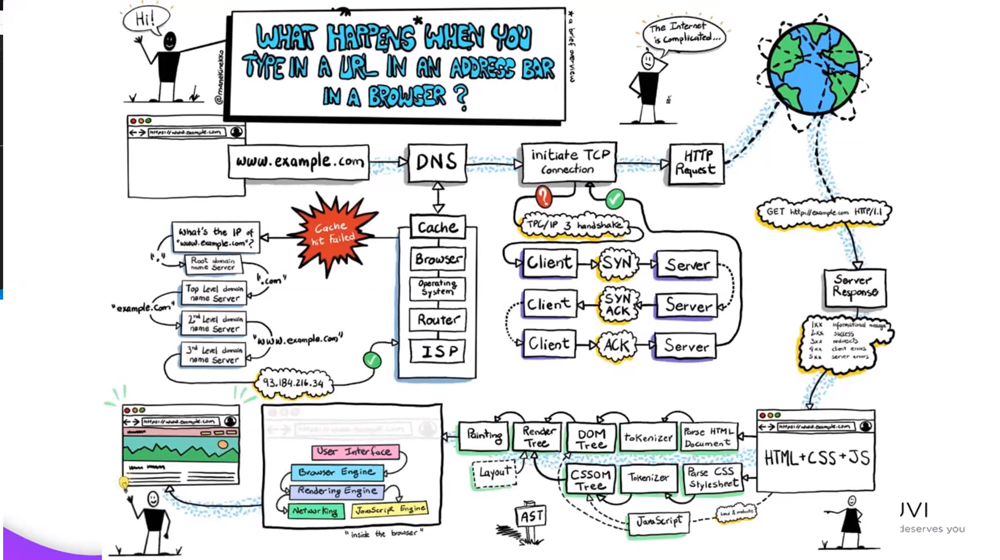

How Internet works:

Step 1: User provided the input in the browser for example "google.com".
Step 2: google.com checks for the IP address, initially in the Local host.
Step 3: If the IP address is not in the local host then the browser will send the IP address to the 
DNS server.
Step 4: The DNS server helps to get the particular IP address of the domain name.
Step 5: Even if the IP address is not in the DNS server then the browser will send the IP address
to the ISP, The ISP will get the IP address of the particular domain name.
step 6: Once the browser sends the IP address then the process of initiating a TCP connection starts.
Step 7: The Browser sends the request to the server for synchronization.
Step 8: The server sends synchronization acknowledgment to the browser the browser sends acknowledgment to the server.
step 9: : Once the TCP connection is established then the process goes through HTTP Request which helps
to find what kind of request that is. if that was a get request then along with the HTTP Protocol it sends the get request to the server.
Step 10: The server sends the response to the browser.
         1XX Informational Message
         2XX Success
         3XX Redirects
         4XX Client Error
         5XX Server Error
Step 11: Once the browser receives success then the browser will get the code of the page that includes the HTML, CSS, and JavaScript.
Step 12: These undergoes Parse HTML and Parse CSS [DOM and CSSOM].
Step 13: The browser loads the user interface, Browser engine Networking, and Javascript engine.
step 14: The google.com page is successfully loaded with all the backend codes.

Step 2: It's more accurate to say that the browser first checks its cache for the IP address before consulting the local host file. The local host file is checked only if the IP address is not found in the cache.
Step 4: The DNS server helps resolve domain names to IP addresses. It's not that the DNS server holds the IP address of every domain; rather, it looks up and returns the IP address associated with the requested domain.
Step 5: The browser doesn't directly send the IP address to the ISP. Instead, if the DNS server provided by the browser's network settings (which may be provided by the ISP) fails to resolve the domain, the DNS request may be forwarded to other DNS servers. However, the browser itself doesn't interact directly with the ISP at this stage.
Step 6 to Step 9: The TCP connection establishment and HTTP request sending process are accurate, but they should be included in a step-by-step breakdown of how the browser communicates with the server after obtaining the IP address.
Step 10: The HTTP response codes you've listed are correct, but it's important to note that they are part of the HTTP protocol used for communication between the browser and the server.
Step 11 to Step 13: These steps accurately describe the process of parsing HTML, CSS, and JavaScript, as well as rendering the web page in the browser.
Step 14: The statement that "the google.com page is successfully loaded with all the backend codes" might be misleading. The backend code (server-side code) executes on the server, not within the browser. The browser loads and renders the frontend code (HTML, CSS, JavaScript) sent by the server.

